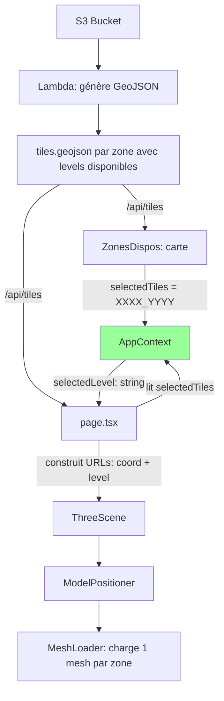

# Plan de refactoring : Architecture des données basée sur les coordonnées

## Contexte

L'application utilise des **URLs S3 complètes** comme identifiant des modèles, alors que l'identité réelle d'une zone est ses **coordonnées `XXXX_YYYY`**. De plus, le LoD automatique par distance caméra sera remplacé par un **choix explicite du niveau de détail par l'utilisateur**.

## Nouveau modèle de données

```
Bucket S3 : meshes/XXXX_YYYY_LL.drc
                    ^^^^^^^^^ ^^
                    coordonnées  niveau de détail
```

- **Coordonnées `XXXX_YYYY`** : clé primaire d'une zone géographique
- **Niveau `LL`** : résolution du mesh (01 = ultra basse, 09 = moyenne, 11 = haute)
- Pour une même zone, plusieurs fichiers de niveaux différents coexistent
- L'utilisateur choisit UN niveau de détail global, et seuls les meshs de ce niveau sont chargés

## Architecture cible



## Étapes du plan

### 1. `fileUtils.ts` : ajouter utilitaires de coordonnées

- Ajouter type `TileCoord = string` (format `XXXX_YYYY`)
- Ajouter `buildMeshUrl(coord, level, bucketUrl): string`
- Ajouter `extractTileCoord(input): TileCoord | null`

### 2. `AppContext.tsx` : refondre le modèle de données

- `selectedTiles: TileCoord[]` — zones sélectionnées (coordonnées)
- `selectedLevel: string` — niveau de détail choisi par l'utilisateur (ex: "09")
- `availableLevels: string[]` — niveaux disponibles globalement
- `tilesData: Map<TileCoord, { levels: string[], x: number, y: number }>` — métadonnées des zones
- `bucketUrl: string` — URL de base du bucket S3
- Supprimer `selectedModels: string[]` (remplacé par selectedTiles + selectedLevel)

### 3. `ZonesDispos.tsx` : sélection par coordonnées

- Au clic sur une tuile, stocker `props.name` (= `XXXX_YYYY`) dans `selectedTiles`
- Le tooltip affiche déjà les niveaux disponibles (fait)
- `handleLoadSelectedTiles` : naviguer vers `/` (les coordonnées sont déjà dans le Context)

### 4. `page.tsx` : simplifier la logique des modèles

- Supprimer `groupMeshesByCoordinates` (plus de LoD automatique)
- Supprimer l'appel à `/api/models` (utiliser uniquement `/api/tiles`)
- Construire les modèles à afficher : pour chaque `TileCoord` sélectionnée, construire l'URL avec `buildMeshUrl(coord, selectedLevel, bucketUrl)`
- Ajouter un sélecteur de niveau de détail dans l'UI (dropdown ou slider)
- Gérer le cas où le niveau choisi n'est pas disponible pour une zone (fallback au niveau le plus proche)

### 5. `ModelPositioner.tsx` : simplifier

- Recevoir une liste de `{ coord: TileCoord, url: string, format: string, coordinates: {x, y} }`
- Plus besoin de `urlHigh/urlLow/urlUltraLow/lodEnabled`
- Un seul `MeshLoader` par zone (plus de `MeshLoaderWithLOD`)

### 6. Interface `Model` unifiée

Définir UNE SEULE interface dans un fichier partagé :

```typescript
interface TileModel {
  coord: TileCoord;       // "0696_6278"
  url: string;            // URL du mesh au niveau sélectionné
  format: "drc" | "ply";
  coordinates: { x: number; y: number }; // pour positionnement 3D
  availableLevels: string[];  // niveaux disponibles pour cette zone
}
```

### 7. Supprimer le code LoD automatique

- Supprimer `MeshLoaderWithLOD.tsx` (ou le garder en archive)
- Supprimer les contrôles LoD dans `LevaUI.tsx` (lodEnabled, lodDistanceHigh, lodDistanceLow)
- Remplacer par un contrôle de sélection du niveau

### 8. Sélecteur de niveau dans l'UI

- Ajouter dans `LevaUI.tsx` ou dans `SceneOverlay.tsx` un sélecteur de niveau
- Options : les niveaux disponibles globalement (union de tous les niveaux de toutes les zones)
- Quand l'utilisateur change le niveau, tous les meshs sont rechargés au nouveau niveau

### 9. Supprimer `/api/models`

Cette API devient redondante. Toutes les infos viennent du GeoJSON via `/api/tiles`.

## Ordre d'exécution recommandé

1. `fileUtils.ts` — utilitaires
2. Créer `types/models.ts` — interface `TileModel` partagée
3. `AppContext.tsx` — nouveau modèle de données
4. `ZonesDispos.tsx` — sélection par coordonnées
5. `page.tsx` — simplifier, utiliser GeoJSON, ajouter sélecteur de niveau
6. `ModelPositioner.tsx` — simplifier
7. `ThreeScene.tsx` — adapter interface
8. `LevaUI.tsx` — remplacer contrôles LoD par sélecteur de niveau
9. Supprimer `MeshLoaderWithLOD.tsx` et `/api/models`
10. Tester le flux complet
