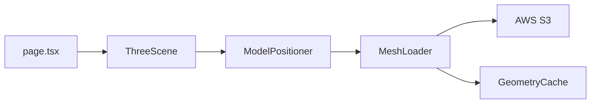
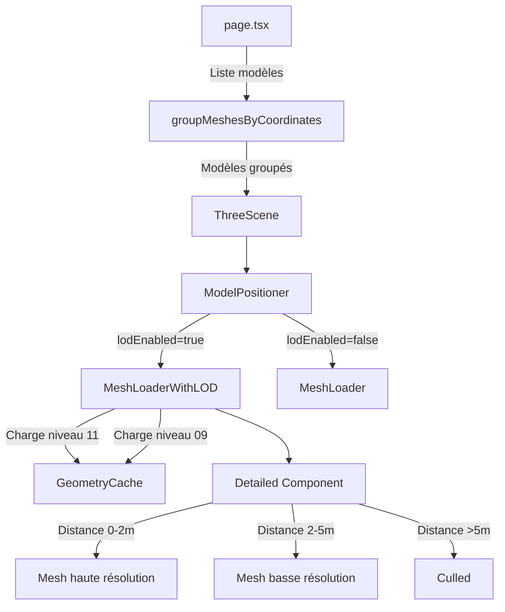

# Plan d'implémentation du Level of Detail (LoD) 

## Vue d'ensemble

Implémenter un système de Level of Detail (LoD) pour afficher les dalles de montagnes en haute résolution (niveau 11) quand la caméra est proche, et en basse résolution (niveau 09) quand elle est éloignée, en utilisant le composant `<Detailed>` de React Three Fiber Drei.

## Architecture actuelle

### Structure des fichiers
- **Format des noms** : `XXXX_YYYY_NN.drc`
  - `XXXX_YYYY` : coordonnées de la dalle (ex: 4565_6534)
  - `NN` : niveau de détail (11 = haute résolution, 09 = basse résolution)

### Composants existants
1. **MeshLoader.tsx** : Charge un mesh individuel depuis AWS S3 avec cache
2. **ModelPositioner.tsx** : Positionne les meshes sélectionnés dans la scène
3. **GeometryCache.ts** : Cache global pour éviter de recharger les géométries
4. **page.tsx** : Gère la liste des modèles disponibles et sélectionnés

### Flux actuel


## Modifications proposées

### 1. Nouveau composant MeshLoaderWithLOD

Créer un composant qui :
- Accepte les URLs pour les niveaux 11 et 09
- Charge les deux meshes en parallèle
- Utilise `<Detailed>` pour basculer selon la distance
- Réutilise la logique existante de MeshLoader

#### Structure du composant

```typescript
interface MeshLoaderWithLODProps {
  urlHigh: string;      // mesh niveau 11
  urlLow: string;       // mesh niveau 09
  format?: "drc";
  onDoubleClick?: (event: any) => void;
  lightDirection?: THREE.Vector3;
  distances?: [number, number]; // distances de transition
}
```

#### Utilisation de Detailed

```typescript
<Detailed distances={[0, 10, 20]}>
  {/* Haute résolution (0-10m) */}
  <mesh geometry={highGeometry} material={material} />
  
  {/* Basse résolution (10-20m) */}
  <mesh geometry={lowGeometry} material={material} />
  
  {/* Culling (>20m) */}
  <mesh />
</Detailed>
```

### 2. Modification de l'interface Model

Étendre l'interface pour supporter les paires LoD :

```typescript
interface Model {
  name: string;           // nom de base sans niveau (ex: "4565_6534")
  urlHigh: string;        // URL niveau 11
  urlLow: string;         // URL niveau 09  
  format?: "ply" | "drc";
  coordinates?: { x: number; y: number };
  fileSize?: number;
  lodEnabled?: boolean;   // flag pour activer le LoD
}
```

### 3. Logique de regroupement des meshes

Dans [`page.tsx`](page.tsx), ajouter une fonction pour regrouper les meshes par coordonnées :

```typescript
function groupMeshesByCoordinates(models: Model[]): Model[] {
  const grouped = new Map<string, { high?: Model, low?: Model }>();
  
  models.forEach(model => {
    const match = model.name.match(/^(\d{4}_\d{4})_(\d{2})$/);
    if (!match) return;
    
    const [_, coords, level] = match;
    const key = coords;
    
    if (!grouped.has(key)) {
      grouped.set(key, {});
    }
    
    const entry = grouped.get(key)!;
    if (level === '11') entry.high = model;
    if (level === '09') entry.low = model;
  });
  
  // Créer les modèles LoD
  const lodModels: Model[] = [];
  grouped.forEach(({ high, low }, coords) => {
    if (high && low) {
      lodModels.push({
        name: coords,
        urlHigh: high.url,
        urlLow: low.url,
        format: 'drc',
        coordinates: high.coordinates,
        lodEnabled: true,
      });
    } else if (high) {
      lodModels.push(high); // Haute résolution seule
    } else if (low) {
      lodModels.push(low);  // Basse résolution seule
    }
  });
  
  return lodModels;
}
```

### 4. Mise à jour de ModelPositioner

Adapter [`ModelPositioner.tsx`](ModelPositioner.tsx:51-56) pour détecter et utiliser le composant LoD :

```typescript
{positionedModels.map((model) => (
  <group
    key={model.name}
    position={model.position}
    rotation={[-Math.PI / 2, 0, 0]}
  >
    {model.lodEnabled ? (
      <MeshLoaderWithLOD
        urlHigh={model.urlHigh}
        urlLow={model.urlLow}
        format={model.format}
        onDoubleClick={onMeshDoubleClick}
        lightDirection={lightDirection}
        distances={[0, 2, 4]} // distances à ajuster
      />
    ) : (
      <MeshLoader
        url={model.url}
        format={model.format}
        onDoubleClick={onMeshDoubleClick}
        lightDirection={lightDirection}
      />
    )}
  </group>
))}
```

### 5. Chargement parallèle et cache

Le nouveau composant doit :
- Charger les deux meshes en parallèle avec `Promise.all`
- Utiliser le [`GeometryCache`](GeometryCache.tsx) existant pour chaque niveau
- Partager les matériaux entre niveaux LoD
- Gérer les états de chargement indépendamment

### 6. Configuration des distances LoD

Les distances optimales dépendent de :
- Taille des dalles (1 km × 1 km)
- Densité des vertices
- Performance cible

#### Valeurs suggérées

```typescript
const LOD_DISTANCES = {
  HIGH_DETAIL: [0, 2],      // 0-2m : haute résolution
  LOW_DETAIL: [2, 5],       // 2-5m : basse résolution  
  CULLED: 5,                // >5m : masqué
};
```

Ces valeurs devront être ajustées après tests.

### 7. Paramètres configurables via LevaUI

Ajouter des contrôles dans [`LevaUI.tsx`](LevaUI.tsx) :

```typescript
{
  lodEnabled: { value: true, label: 'Activer LoD' },
  lodDistanceHigh: { value: 2, min: 0.5, max: 10, step: 0.5, label: 'Distance haute résolution' },
  lodDistanceLow: { value: 5, min: 1, max: 20, step: 0.5, label: 'Distance basse résolution' },
}
```

## Diagramme de flux proposé



## Étapes d'implémentation

### Phase 1 : Préparation
1. Créer le fichier `MeshLoaderWithLOD.tsx`
2. Copier la structure de base de `MeshLoader.tsx`
3. Installer/vérifier `@react-three/drei` avec `<Detailed>`

### Phase 2 : Composant LoD
1. Implémenter le chargement dual (haute + basse résolution)
2. Intégrer `<Detailed>` avec les deux géométries
3. Réutiliser les matériaux existants (HauteMontagne, BasseMontagne)
4. Gérer les états de chargement et erreurs

### Phase 3 : Regroupement des données
1. Ajouter la fonction `groupMeshesByCoordinates` dans `page.tsx`
2. Modifier l'interface `Model` pour supporter LoD
3. Mettre à jour l'API `/api/models` si nécessaire

### Phase 4 : Intégration
1. Modifier `ModelPositioner` pour détecter les modèles LoD
2. Rendre conditionnel l'usage de `MeshLoaderWithLOD` vs `MeshLoader`
3. Propager les props nécessaires

### Phase 5 : Configuration
1. Ajouter les contrôles LoD dans `LevaUI`
2. Permettre l'ajustement des distances en temps réel
3. Ajouter un indicateur visuel du niveau actif (debug)

### Phase 6 : Tests et optimisation
1. Tester avec différentes distances de caméra
2. Mesurer l'impact sur les performances
3. Ajuster les seuils de distance
4. Vérifier la transition fluide entre niveaux

## Considérations techniques

### Performance
- **Chargement initial** : Les deux niveaux sont chargés en parallèle (surcoût réseau initial)
- **Mémoire** : Deux géométries en RAM par dalle (à surveiller)
- **GPU** : Une seule géométrie rendue à la fois grâce à `<Detailed>`

### Compatibilité
- ✅ Compatible avec le cache existant
- ✅ Compatible avec les shaders HauteMontagne/BasseMontagne
- ✅ Compatible avec les fichiers locaux uploadés
- ⚠️ Nécessite que les deux niveaux existent sur S3

### Fallback
Si un seul niveau existe :
- Afficher la version disponible
- Désactiver automatiquement le LoD
- Logger un warning

## Points d'attention

1. **Nommage cohérent** : S'assurer que les fichiers respectent bien le format `XXXX_YYYY_NN.drc`
2. **Transitions brutales** : Les transitions de `<Detailed>` sont instantanées (pas de morphing)
3. **Distance caméra** : Calculée depuis le centre de l'objet, pas la surface
4. **Nombre de niveaux** : Actuellement 2 (11 et 09), extensible à 3+ si besoin
5. **Cache** : Les deux niveaux sont mis en cache indépendamment

## Extensions futures possibles

1. **Niveau intermédiaire** : Ajouter un niveau 10 entre 11 et 09
2. **LoD dynamique** : Charger/décharger selon la distance pour économiser la RAM
3. **Morphing** : Transition progressive entre niveaux (plus complexe)
4. **Calcul automatique** : Déterminer les distances optimales selon la taille du mesh
5. **LoD géographique** : Niveaux différents selon l'importance du terrain

## Ressources

- [Documentation Drei Detailed](https://github.com/pmndrs/drei#detailed)
- [Three.js LOD](https://threejs.org/docs/#api/en/objects/LOD)
- [React Three Fiber](https://docs.pmnd.rs/react-three-fiber)

---

**Date de création** : 2026-02-04  
**Auteur** : Kilo Code Assistant  
**Statut** : Prêt pour implémentation
