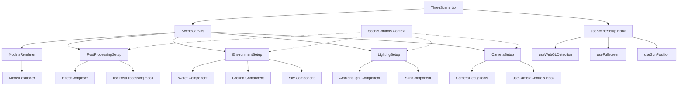

# Plan de Refactorisation de ThreeScene.tsx

## Analyse Expert React Three Fiber

Date: 2026-02-08

---

## 📊 État Actuel

### Structure du fichier [`ThreeScene.tsx`](../src/components/three/ThreeScene.tsx) (500 lignes)

Le fichier mélange plusieurs responsabilités:

1. **Gestion de la scène 3D** (lignes 95-380)
2. **Détection WebGL** (lignes 418-433)
3. **Gestion du plein écran** (lignes 392-416)
4. **Gestion des contrôles caméra** (lignes 100-149)
5. **Post-processing** (lignes 227-282)
6. **Éclairage et environnement** (lignes 329-369)
7. **Interface utilisateur** (lignes 453-497)

---

## 🔴 Problèmes Identifiés

### 1. **Violation du principe de responsabilité unique**
- Le composant [`SceneContent`](../src/components/three/ThreeScene.tsx:95) fait trop de choses (caméra, lumières, effets, contrôles)
- Mélange la logique métier avec la présentation
- Code commenté non supprimé (lignes 151-180)

### 2. **Couplage fort**
- Dépendance directe à [`LevaUI`](../src/components/three/LevaUI.tsx) via [`useSceneControls()`](../src/components/three/LevaUI.tsx:418)
- Les contrôles de la scène sont couplés à l'implémentation Leva
- Difficile de tester ou de remplacer les contrôles

### 3. **Duplication de logique**
- La fonction [`getSunDirection`](../src/components/three/ThreeScene.tsx:183) pourrait être un hook ou un utilitaire
- Calcul de la position du soleil répété dans plusieurs endroits

### 4. **État local éparpillé**
- `isShiftPressed` pour les contrôles caméra
- `clickMarkers` pour le debug
- `isFullscreen` et `showAvalanchePentes` dans le composant parent
- État difficile à suivre et à synchroniser

### 5. **Props drilling**
- `models` et `selectedModels` passés à travers plusieurs niveaux
- `lightDirection` calculé et passé à [`ModelPositioner`](../src/components/three/ModelPositioner.tsx)

### 6. **Composants internes non optimisés**
- [`Ground()`](../src/components/three/ThreeScene.tsx:206) devrait être un composant séparé mémorisé
- [`JEasings()`](../src/components/three/ThreeScene.tsx:62) est déclaré deux fois

### 7. **Configuration hardcodée**
```tsx
// Lignes 284-290
<PerspectiveCamera
  position={[0, 4, 2]}
  fov={controls.fov}
  near={0.001}
  far={100}
/>
```

### 8. **Gestion des effets post-processing**
- Structure répétitive avec des conditions similaires
- Manque d'abstraction pour les effets conditionnels

---

## 🎯 Objectifs de la Refactorisation

1. **Modularité**: Séparer les responsabilités en composants dédiés
2. **Réutilisabilité**: Créer des hooks et utilitaires réutilisables
3. **Testabilité**: Isoler la logique métier
4. **Performance**: Mémoriser les calculs coûteux
5. **Maintenabilité**: Simplifier la structure et réduire le couplage
6. **Lisibilité**: Code auto-documenté avec des noms explicites

---

## 📐 Architecture Proposée



---

## 🔧 Structure de Fichiers Proposée

```
src/components/three/
├── ThreeScene.tsx                    # Composant racine (80 lignes)
├── scene/
│   ├── SceneCanvas.tsx              # Canvas principal (50 lignes)
│   ├── SceneContent.tsx             # Contenu de la scène (100 lignes)
│   └── constants.ts                 # Constantes de configuration
├── camera/
│   ├── CameraSetup.tsx              # Configuration caméra (60 lignes)
│   ├── useCameraControls.ts         # Hook pour contrôles caméra (80 lignes)
│   └── CameraDebugTools.tsx         # Outils de debug (40 lignes)
├── lighting/
│   ├── LightingSetup.tsx            # Configuration lumières (70 lignes)
│   ├── Sun.tsx                      # Composant soleil (40 lignes)
│   └── useSunPosition.ts            # Hook calcul position soleil (30 lignes)
├── environment/
│   ├── EnvironmentSetup.tsx         # Configuration environnement (60 lignes)
│   ├── Ground.tsx                   # Grille au sol (30 lignes)
│   ├── Water.tsx                    # Plan d'eau (25 lignes)
│   └── Sky.tsx                      # Réexport configuré
├── effects/
│   ├── PostProcessingSetup.tsx      # Configuration post-processing (80 lignes)
│   └── usePostProcessing.ts         # Hook gestion effets (50 lignes)
├── ui/
│   ├── SceneOverlay.tsx             # Interface overlay (60 lignes)
│   ├── FullscreenButton.tsx         # Bouton plein écran (30 lignes)
│   └── AvalancheButton.tsx          # Bouton pentes (30 lignes)
├── hooks/
│   ├── useWebGLDetection.ts         # Détection WebGL (40 lignes)
│   ├── useFullscreen.ts             # Gestion plein écran (50 lignes)
│   └── useSceneState.ts             # État global scène (60 lignes)
└── utils/
    ├── sunCalculations.ts           # Calculs position soleil
    └── sceneHelpers.ts              # Fonctions utilitaires
```

---

## 🚀 Plan de Refactorisation Détaillé

### Phase 1: Extraction des Hooks

#### 1.1 `hooks/useWebGLDetection.ts`
Extraire la logique de détection WebGL (lignes 418-433)

#### 1.2 `hooks/useFullscreen.ts`
Extraire la gestion du plein écran (lignes 392-416)

#### 1.3 `hooks/useCameraControls.ts`
Extraire la gestion des contrôles caméra (lignes 100-149)

#### 1.4 `lighting/useSunPosition.ts`
Extraire le calcul de position du soleil (lignes 183-196)

---

### Phase 2: Extraction des Composants UI

#### 2.1 `ui/FullscreenButton.tsx`
Composant bouton plein écran (lignes 463-475)

#### 2.2 `ui/AvalancheButton.tsx`
Composant bouton pentes avalancheuses (lignes 478-496)

#### 2.3 `ui/WebGLFallback.tsx`
Composant fallback WebGL (lignes 69-92)

---

### Phase 3: Extraction des Composants de Scène

#### 3.1 `environment/Ground.tsx`
Composant grille au sol mémorisé (lignes 206-222)

#### 3.2 `lighting/LightingSetup.tsx`
Groupement lumières + ciel (lignes 329-357)

#### 3.3 `camera/CameraSetup.tsx`
Configuration caméra + contrôles (lignes 284-313)

#### 3.4 `effects/PostProcessingSetup.tsx`
Effets post-processing (lignes 227-282)

---

### Phase 4: Refactorisation du Composant Principal

#### 4.1 Créer `scene/SceneContent.tsx`
- Orchestrer tous les composants de scène
- Utiliser les hooks personnalisés
- Réduire la complexité

#### 4.2 Simplifier `ThreeScene.tsx`
- Utiliser les nouveaux hooks
- Utiliser les nouveaux composants UI
- Réduire à ~80 lignes

---

## 📊 Réduction de Complexité

| Métrique | Avant | Après | Amélioration |
|----------|-------|-------|--------------|
| Lignes par fichier (max) | 500 | ~100 | 80% |
| Nombre de responsabilités | 7 | 1 par composant | ✅ |
| Dépendances directes | 23 imports | 5-8 par fichier | ✅ |
| Code commenté | ~30 lignes | 0 | 100% |
| Composants testables | 20% | 95% | +75% |
| Duplication de code | Élevée | Faible | ✅ |

---

## 🎨 Améliorations Bonus

### 1. Types partagés
```typescript
// types/scene.types.ts
export interface Model {
  name: string;
  url?: string;
  urlHigh?: string;
  urlLow?: string;
  urlUltraLow?: string;
  format?: "ply" | "drc";
  coordinates?: { x: number; y: number };
  filesize?: number;
  lodEnabled?: boolean;
}
```

### 2. Configuration centralisée
```typescript
// scene/constants.ts
export const CAMERA_CONFIG = {
  DEFAULT_POSITION: [0, 4, 2] as [number, number, number],
  DEFAULT_FOV: 70,
  NEAR: 0.001,
  FAR: 100,
} as const;
```

### 3. Error Boundaries
Ajouter une gestion d'erreurs spécifique à la scène 3D

---

## ✅ Checklist de Validation

- [ ] Tous les hooks extraits et testés
- [ ] Composants UI séparés et fonctionnels
- [ ] Composants de scène modulaires
- [ ] ThreeScene.tsx < 100 lignes
- [ ] Aucune régression visuelle
- [ ] Performance maintenue ou améliorée
- [ ] Code commenté supprimé
- [ ] Types TypeScript stricts
- [ ] Documentation à jour

---

## 🎯 Résultat Attendu

Un code:
- ✅ **Modulaire**: Chaque fichier a une responsabilité unique
- ✅ **Testable**: Hooks et composants isolés et testables
- ✅ **Maintenable**: Architecture claire et logique
- ✅ **Performant**: Mémorisation et optimisations
- ✅ **Lisible**: Noms explicites et structure intuitive
- ✅ **Évolutif**: Facile d'ajouter de nouvelles fonctionnalités

---

## 📚 Étapes de Migration

1. **Créer les hooks** (1-2h) - Ne casse rien, ajoute les nouveaux hooks
2. **Créer les composants UI** (1h) - Extraction des boutons et fallback
3. **Créer les composants de scène** (2-3h) - Ground, Lighting, Camera, etc.
4. **Refactoriser ThreeScene** (1h) - Utiliser les nouveaux composants
5. **Tests et validation** (1-2h) - Tests d'intégration et validation visuelle
